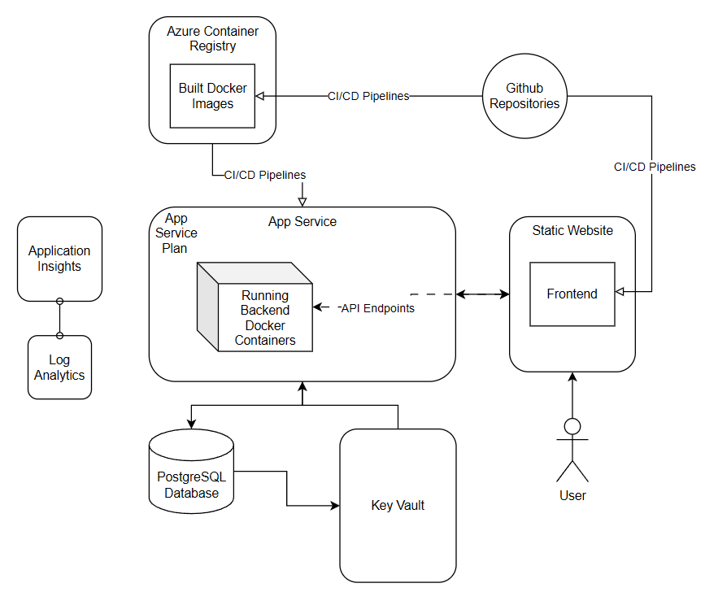

# Requirements and Design Documentation

## Architechture Design & Planning

### Infrastructure Architecture Design

*Figure 1: Infrastructure Architechture Design*

#### GitHub
Github is the platform we used to host our infrastructure repository. The repo contains Bicep templates for each resource (see below). Github actions was used to fulfill the resource deployments.

#### App Service for containers 
The main purpose of the App Service Container is to host the containerized backend application. It retrieves the Azure Container Registry credentials from the Key Vault which enables access to pull the container image for the backend. This resource depends on the App Service Plan for the compute resources, the Key Vault for secret retrieval, and the Azure Container Registry for the container image hosting. The App Service for Containers inputs the `appServicePlan.id` to link to the App Service Plan. The App Service for Containers outputs the App Service Host Name and the Managed Identity Principle ID.

#### App Service Plan 
The App Service Plan is used to allocate resrouces (such as CPU, memory, etc.) to the app services (static website and container for backend). The App Service Plan outputs the `appServicePlan.id`.

#### PostgreSQL database
The PostgreSQL database is used to store and manage the user account information. It is hosted by the PostgreSQL server.

#### PostgreSQL server
This server provides access to the database by securely accessing the App Service Back End by using the admin managed identity. The postgreSQLAdministrators resource configures an Azure Active Directory service principle as the admin of the database by passing in the Managed Identity Principle ID from the App Service for Containers. The Admin is able to manage the databases, users, and permissions. The Server bicep outputs the `postgreSQLServer.id`.

#### Static website 
The static website resource hosts the front end. It inputs the `appServicePlan.id` to link to the App Service Plan for its necessary resources. One interesting configuration is the `httpsOnly` set to true to ensure communication between users and the static site is secure. The static website outputs the hostname (a URL) for access to the deployed app.

#### Azure Container Registry
The Azure Container Registry stores the container images that will be used by the App Service. The ACR generates a user and two passwords that are needed by other modules for access. The ACR credential values are dynamically fetched using the `listCredentials` function and are stored in the Key Vault as secrets.

#### Key Vault
The Key Vault stores and encrpts sensitive information like the ACR credentials. By using a Key Vault, we securely access them without ever exposing them in plain text.

#### Log Analytics Workspace
The Log Analytics Workspace collects, stores, and analyzes log and telemetry data from the resources for monitoring.

#### Application Insights
Application Insights provides insights into the application performance, user behavior, and diagnostics of both the front and back end, which enables proactive issue detection and resolution.

#### **Modularization Strategy**

To streamline the deployment and management of the infrastructure, we used the following modularization strategy:

- **Separation of Concerns:**  
  Each module in the repository is designed to handle a specific aspect of the infrastructure. This ensures maintainability, reusability, and scalability.

- **Main Bicep File:**  
  The `main.bicep` file acts as the orchestration layer. It references all modules and integrates them with environment-specific configurations through JSON parameter files.

- **Modules:**
  - **App Service Container Module (`app-service-container.bicep`):**  
    Configures the backend App Service, enabling system-assigned identity and secure integration with Key Vault and Azure Container Registry.
  - **Backend App Service Website Module (`app-service-website.bicep`):**  
    Configures the frontend App Service websites, enabling HTTPS-only traffic, custom domains, and integration with the App Service Plan.
  - **PostgreSQL Module (`postgre-sql-server.bicep`):**  
    Deploys the PostgreSQL server with AAD authentication and connects the App Service using managed identity.
  - **Database Module (`postgre-sql-db.bicep`):**  
    Creates the database within the PostgreSQL server, with configurations such as charset and collation.
  - **Key Vault Module (`keyVault.bicep`):**  
    Sets up the Key Vault for storing sensitive credentials like ACR admin credentials and database passwords.
  - **App Service Plan Module (`app-service-plan.bicep`):**  
    Provisions compute resources shared by backend and frontend services.
  - **Azure Container Registry Module (`acr.bicep`):**  
    Deploys the ACR to host containerized application images.

- **Environment-Specific Configuration:**  
  - Separate parameter files (`dev.parameters.json`, `uat.parameters.json`, and `prod.parameters.json`(coming soon)) define environment-specific configurations like resource group names, locations, and sensitive values.
  - This supports consistency across environments while allowing flexibility.

- **Automation and CI/CD:**  
  - GitHub Actions workflows automate the deployment process for each environment, triggered by `push`, `pull_request`, or `workflow_dispatch` events.
  - The modularized design ensures seamless integration of changes and simplifies troubleshooting.

### Environment Design

- **Which environments do we need for our workloads?**
  - And what configuration will our Azure services have for each environment?
- with the infra dev and the full stack dev

#### **Development Environment (DEV)**

| Azure Infra Service                  | Configurations                                                                                       |
| ------------------------------------ | ---------------------------------------------------------------------------------------------------- |
| **GitHub**                           | Triggers deployments via `push` or `workflow_dispatch` (manually). Uses separate `RESOURCE_GROUP_DEV`. |
| **App Service for containers**       | `makenna-be-dev`, connected to the ACR for pulling the backend container image securely.              |
| **App Service Plan**                 | `makenna-asp-dev`, SKU: `B1`, used for compute resources for backend and frontend.                    |
| **PostgreSQL database**              | `makenna-db-dev`, hosted on `makenna-dbsrv-dev` with admin identity and AAD authentication enabled.   |
| **Static website**                   | `makenna-fe-dev`, hosted in the same `App Service Plan` as the backend.                               |
| **Azure Container Registry**         | `makennaacrdev`, stores backend container images. Admin credentials securely stored in Key Vault.     |
| **Key Vault**                        | `makenna-keyvault-dev`, stores sensitive credentials like ACR admin credentials and PostgreSQL users. |
| **Log Analytics Workspace**          | Used for monitoring and collecting log data for resources in the development environment. **(check w/SRE)**           |
| **Application Insights**             | Configured for backend and frontend App Services to monitor application performance and diagnose issues. **(check w/SRE)**|

---

#### **User Acceptance Testing Environment (UAT)**

| Azure Infra Service                  | Configurations                                                                                       |
| ------------------------------------ | ---------------------------------------------------------------------------------------------------- |
| **GitHub**                           | Triggers deployments via `pull_request` or `workflow_dispatch`. Uses separate `RESOURCE_GROUP_UAT`.   |
| **App Service for containers**       | `makenna-be-uat`, connected to the ACR for pulling the backend container image securely.              |
| **App Service Plan**                 | `makenna-asp-uat`, SKU: `B1`, used for compute resources for backend and frontend.                    |
| **PostgreSQL database**              | `makenna-db-uat`, hosted on `makenna-dbsrv-uat` with admin identity and AAD authentication enabled.   |
| **Static website**                   | `makenna-fe-uat`, hosted in the same `App Service Plan` as the backend.                               |
| **Azure Container Registry**         | `makennaacruat`, stores backend container images. Admin credentials securely stored in Key Vault.     |
| **Key Vault**                        | `makenna-keyvault-uat`, stores sensitive credentials like ACR admin credentials and PostgreSQL users. |
| **Log Analytics Workspace**          | Used for monitoring and collecting log data for resources in the user acceptance testing environment.**(check w/SRE)** |
| **Application Insights**             | Configured for backend and frontend App Services to monitor application performance and diagnose issues. **(check w/SRE)**|

#### Production Environment (PROD)

| Azure Infra Service                  | Configurations |
| ------------------------------------ | -------------- |
| **GitHub**                     |                |
| **App Service for containers** |                |
| **App Service Plan**           |                |
| **PostgreSQL database**        |                |
| **Static website**             |                |
| **Azure Container Registry**   |                |
| **Key Vault**                  |                |
| **Log Analytics Workspace**    |                |
| **Application Insights**       |                |

### Well-Architected Framework

#### Reliability

- with site reliability engineer
- SLI 1: Account Availability: Ensure 95% of account access requests are successful.
- SLI 2: Time to Access: Ensure 85% of page requests are loaded within 500ms.
- SLI 3: Transaction Processing Time: Ensure 99% of transactions are completed within 2 seconds.
- SLI 4: Login Success Rate: Ensure 99.9% of login attempts are successful without errors due to system issues.
- SLI 5: Fund Transfer Accuracy: Ensure 99.99% of fund transfers are accurate and error-free.

| RE:NUM | Description                                                                                                                               | Implementation |
| ------ | ----------------------------------------------------------------------------------------------------------------------------------------- | -------------- |
| RE:01  | Design your workload to align with business objectives and avoid unnecessary complexity or overhead.                                      |                |
| RE:02  | Identify and rate user and system flows.                                                                                                  |                |
| RE:03  | Use failure mode analysis (FMA) to identify and prioritize potential failures in your solution components.                                |                |
| RE:04  | Define reliability and recovery targets for the components.                                                                               |                |
| RE:05  | Add redundancy at different levels, especially for critical flows.                                                                        |                |
| RE:06  | Implement a timely and reliable scaling strategy at the application, data, and infrastructure levels.                                     |                |
| RE:07  | Strengthen the resiliency and recoverability of your workload by implementing self-preservation and self-healing measures.                |                |
| RE:08  | Test for resiliency and availability scenarios by applying the principles of chaos engineering in your test and production environments.  |                |
| RE:09  | Implement structured, tested, and documented business continuity and disaster recovery (BCDR) plans that align with the recovery targets. |                |
| RE:10  | Measure and model the solution's health signals.                                                                                          |                |

#### Security

https://learn.microsoft.com/en-us/devops/devsecops/enable-devsecops-azure-github#secure-your-code-with-github
https://learn.microsoft.com/en-us/devops/devsecops/enable-devsecops-azure-github#secure-your-code-with-github
https://best.openssf.org/Concise-Guide-for-Developing-More-Secure-Software

| SE:NUM | Description                                                                                                                                       | Implementation |
| ------ | ------------------------------------------------------------------------------------------------------------------------------------------------- | -------------- |
| SE:01  | Establish a security baseline that's aligned to compliance requirements, industry standards, and platform recommendations.                        |                |
| SE:02  | Maintain a secure development lifecycle.                                                                                                          |                |
| SE:03  | Classify and consistently apply sensitivity and information type labels.                                                                          |                |
| SE:04  | Create intentional segmentation and perimeters in your architecture design and in the workload's footprint on the platform.                       |                |
| SE:05  | Implement strict, conditional, and auditable identity and access management (IAM) across all workload users, team members, and system components. |                |
| SE:06  | Isolate, filter, and control network traffic across both ingress and egress flows.                                                                |                |
| SE:07  | Encrypt data by using modern, industry-standard methods to guard confidentiality and integrity.                                                   |                |
| SE:08  | Harden all workload components by reducing extraneous surface area and tightening configurations to increase attacker cost.                       |                |
| SE:09  | Protect application secrets by hardening their storage and restricting access and manipulation and by auditing those actions.                     |                |
| SE:10  | Implement a holistic monitoring strategy that relies on modern threat detection mechanisms that can be integrated with the platform.              |                |
| SE:11  | Establish a comprehensive testing regimen.                                                                                                        |                |
| SE:12  | Define and test effective incident response procedures.                                                                                           |                |

#### Cost Optimization
  - Burstable SKU for PostgreSQL Server: This setting configures the PostgreSQL server with the Standard_B1ms SKU, a burstable VM type (meaning that the server can “burst” to higher levels to support occasional spikes in usage). This setup optimizes costs by allocating resources dynamically.
  - Basic SKU for Azure Container Registry: The ACR’s SKU is set to Basic in the dev and UAT environments, which reduces costs for non-critical workloads while still supporting required container operations.
  - Environment-Specific Parameters: Beneficial because it allows environment specific parameters to ensure that non-production environments use less expensive resources, (ex: flask_debug is set to 0 in non production environments) while still offering flexibility in the prod environment.

| CO:NUM | Description                                                                                                                                                                   | Implementation |
| ------ | ----------------------------------------------------------------------------------------------------------------------------------------------------------------------------- | -------------- |
| CO:01  | Create a culture of financial responsibility.                                                                                                                                 |                |
| CO:02  | Create and maintain a cost model. A cost model should estimate the initial cost, run rates, and ongoing costs.                                                                |                |
| CO:03  | Collect and review cost data. Data collection should capture daily costs.                                                                                                     |                |
| CO:04  | Set spending guardrails.                                                                                                                                                      |                |
| CO:05  | Get the best rates from providers.                                                                                                                                            |                |
| CO:06  | Align usage to billing increments.                                                                                                                                            |                |
| CO:07  | Optimize component costs.                                                                                                                                                     |                |
| CO:08  | Optimize environment costs. Align spending to prioritize preproduction, production, operations, and disaster recovery environments.                                           |                |
| CO:09  | Optimize flow costs. Align the cost of each flow with flow priority.                                                                                                          |                |
| CO:10  | Optimize data costs.                                                                                                                                                          |                |
| CO:11  | Optimize code costs. Evaluate and modify code to meet functional and nonfunctional requirements with fewer or cheaper resources.                                              |                |
| CO:12  | Optimize scaling costs. Evaluate alternative scaling within your scale units.                                                                                                 |                |
| CO:13  | Optimize personnel time. Align the time personnel spends on tasks with the priority of the task. The goal is to reduce the time spent on tasks without degrading the outcome. |                |
| CO:14  | Consolidate resources and responsibility.                                                                                                                                     |                |

#### Operational Excellence

- with full stack dev
- Collaborate to create Azure Dashboards for SLO compliance tracking and holistic observability.

| OE:NUM | Description                                                                                                                                                                                | Implementation |
| ------ | ------------------------------------------------------------------------------------------------------------------------------------------------------------------------------------------ | -------------- |
| OE:01  | Determine workload team members' specializations and integrate them into a robust set of practices to design, develop, deploy, and operate your workload to specification.                 |                |
| OE:02  | Formalize the way you run routine, as needed, and emergency operational tasks by using documentation, checklists, or automation.                                                           |                |
| OE:03  | Formalize software ideation and planning processes.                                                                                                                                        |                |
| OE:04  | Optimize software development and quality assurance processes by following industry-proven practices for development and testing.                                                          |                |
| OE:05  | Prepare resources and their configurations by using a standardized infrastructure as code (IaC) approach.                                                                                  |                |
| OE:06  | Build a workload supply chain that drives proposed changes through predictable, automated pipelines.                                                                                       |                |
| OE:07  | Design and implement a monitoring system to validate design choices and inform future design and business decisions.                                                                       |                |
| OE:08  | Develop an effective emergency operations practice.                                                                                                                                        |                |
| OE:09  | Automate all tasks that don't benefit from the insight and adaptability of human intervention, are highly procedural, and have a shelf-life that yields a return on automation investment. |                |
| OE:10  | Design and implement automation upfront for operations such as lifecycle concerns, bootstrapping, and applying governance and compliance guardrails.                                       |                |
| OE:11  | Clearly define your workload's safe deployment practices. Emphasize the ideals of small, incremental, quality-gated release methods.                                                       |                |
| OE:12  | Implement a deployment failure mitigation strategy that addresses unexpected mid-rollout issues with rapid recovery.                                                                       |                |

#### Performance Efficiency

- Parameterized Deployments with Bicep: Adapts deployments to specific environment needs, without requiring manual changes.
- Application insights monitoring: Integrated for all environments to monitor application performance metrics and identify bottlenecks, allowing for proactive optimization.
- Conduct load testing for SLI 2: Page Load Time and SLI 3: Transaction Processing Time.
- Optimize scalability of infrastructure to handle peak loads while maintaining performance thresholds.

| PE:NUM | Description                                                                                                                                                                                   | Implementation |
| ------ | --------------------------------------------------------------------------------------------------------------------------------------------------------------------------------------------- | -------------- |
| PE:01  | Define performance targets.                                                                                                                                                                   |                |
| PE:02  | Conduct capacity planning.                                                                                                                                                                    |                |
| PE:03  | Select the right services. The services, infrastructure, and tier selections must support your ability to reach the workload's performance targets and accommodate expected capacity changes. |                |
| PE:04  | Collect performance data.                                                                                                                                                                     |                |
| PE:05  | Optimize scaling and partitioning.                                                                                                                                                            |                |
| PE:06  | Test performance. Perform regular testing in an environment that matches the production environment.                                                                                          |                |
| PE:07  | Optimize code and infrastructure.                                                                                                                                                             |                |
| PE:08  | Optimize data usage.                                                                                                                                                                          |                |
| PE:09  | Prioritize the performance of critical flows.                                                                                                                                                 |                |
| PE:10  | Optimize operational tasks.                                                                                                                                                                   |                |
| PE:11  | Respond to live performance issues.                                                                                                                                                           |                |
| PE:12  | Continuously optimize performance.                                                                                                                                                            |                |

## Software Design & Planning

### Release Strategy Design
The release strategy follows a DTAP (Development, Testing, Acceptance, and Production) environment approach. Each environment is managed separately, leveraging Azure services to ensure proper isolation and scalability. GitHub Actions have been configured to handle CI/CD for development, UAT, and production workflows. The strategy ensures:

Development branch triggers deployment to the DEV environment.
Pull requests to the main branch deploy to UAT.
Successful merges into the main branch trigger production deployments.
The strategy also incorporates Test-Driven Development (TDD) principles to validate functionality before integration, ensuring quality and robustness at every stage.

### CI/CD Pipeline and Release Strategy

#### Git feature branch strategy
- The startegy adopted for both Backend and Frontend focused on the implementation of short-lived feauture branches derived from the main branch. This helped managing updates to the code and better understanding and debugging of code due to its modular nature, as each feature, user story or task was done on seperate branches. After checking that the workflow actions fully deploy and work, a pull request is made, where two reviewers are called to give their approval for the merging to the main branch.
- Examples:
      - backend had branches called containerization, one called backendci (here the implementation of backed CI/CD was implemented), ayacibe (where another approach to CI/CD was implemnted) and prodcicd (where the variables and parameters to integrate and deploy the backend in the Production resource group)
      - frontend had two branches for the CI/CD with two different approaches (ayacife and ciayafe), and three branches where errors were fixed called ayanew, fixingfe and null-cookie-fix. And one last one called prod where the yml file was changed to integrate and deploy in the production environment.

#### Frontend

**CI Description**

The CI pipeline for the Vue.js-based frontend application automates the following steps, as defined in the ie-bank-frontend.yml workflow:

1. Dependency Installation:
the jobs start with installing all required dependencies in a clean, consistent environment using npm ci. Then it ensure that all packages and dependicies are conssitent with what was outlined in the package-lock.json where version of the dependencies were defined. 

2. Build Verification:
This job is split into three parts for the three environments (DEV, UAT, PROD) and ensures that it compiles correctly

3. Linting:
Executes npm run lint to perform static code analysis and enforce coding standards, reducing errors and maintaining code consistency.

4. Artifact Upload:
This part Uploads the compiled build artifacts (e.g., dist-dev or dist-uat) as deployable outputs for the CD pipeline.

Fixed Issues:

  - Missing dependencies (e.g., axios, vue-router) were resolved by updating package.json.
  - Adjusted vue.config.js for compatibility with development and UAT builds

**CD Description**
The CD pipeline deploys built artifacts to the respective Azure environments:

Artifact Download: Downloads the prepared build artifacts.
Azure Login: Authenticates with Azure using a service principal.
Deployment: Deploys the frontend to the static web app service for DEV or UAT, depending on the trigger.
- Fixed Issues:

Proper artifact paths (dist-dev or dist-uat) ensured successful deployments without file-not-found errors.

#### Backend

**CI Description**
The backend CI pipeline validates the Flask-based API, as defined in ie-bank-backend.yml. Key steps include:

1. Environment Setup:
Using pip install all python dependencies which are defined in the requirements.txt are to be installed. then the 3 environemnt and their appropriate variables (BACKEND_WEBAPP, DOCKER_REGISTRY_SERVER_URL, IMAGE_NAME, KEY_VAULT_NAME) are defined for all environemnts. 

2. Static Analysis:
flake8 is implemnetd to enforce Python coding standards and catching potential bugs or syntax issues early.

3. Unit Testing:
  - Unit and Functional Testing: Executes pytest for unit and functional tests to validate core API functionality, using a PostgreSQL test database defined in the workflow.

Coverage Reports:

after testing the coverage reports are then geneated and uploaded using pytest-cov, ensuring all critical code paths are tested.

- Fixed Issues:
  
  - Enhanced test reliability by mocking dependencies and isolating tests.

**CD Description**
The CD pipeline builds and deploys the Flask backend as a Docker container:

Docker Build: Creates container images for DEV or UAT using environment-specific Dockerfiles.
Push to Registry: Publishes images to Azure Container Registry.
App Service Deployment: Deploys containers to Azure App Service.
- Fixed Issues:

Fixed missing Dockerfiles and resolved registry authentication failures by retrieving credentials from Azure Key Vault.

#### Test/behavior driven development strategy

The Test/Behavior Driven Development (TDD) strategy implemented emphasizes building robust and reliable software by designing tests derived directly from user stories and acceptance criteria. The strategy, as documented in the Design Document, focuses on creating automated unit and functional tests that validate core backend functionalities, ensuring alignment with defined business logic.

The designed tests cover key aspects of the backend API:

Functional Tests: Verify critical user-facing functionalities, such as fetching account details (test_get_accounts) and creating new accounts (test_create_account). Additionally, edge cases like invalid routes are tested using cases like test_dummy_wrong_path to ensure the API gracefully handles errors.
Unit Tests: Test core backend logic, such as database model operations, exemplified by test_create_account in the test_model.py file, ensuring backend stability at the data layer.
The tests were executed using Pytest, generating a detailed test coverage report. The coverage breakdown reveals the focus on functional robustness and highlights areas for potential improvement, such as the routes.py file, which currently has partial test coverage. This aligns with the iterative nature of TDD, prioritizing test implementation for high-impact code paths first.

This approach is directly tied to user stories such as "As a user, I want to create an account so that I can use the banking services" and "As a user, I want to view my account details to track my finances." By designing and executing tests based on these stories, the development team ensured that the implemented functionalities met user requirements while maintaining a high standard of quality.

### Use Cases and Sequential Model Design

Must include for each use case

### Entity Relationship Design

### Data Flow Diagram

### 12 Factor App Design

1. **Codebase**
   One codebase tracked in revision control, many deploys
2. **Dependencies**
   Explicitly declare and isolate dependencies
3. **Config**
   Store config in the environment
4. **Backing services**
   Treat backing services as attached resources
5. **Build, release, run**
   Strictly separate build and run stages
6. **Processes**
   Execute the app as one or more stateless processes
7. **Port binding**
   Export services via port binding
8. **Concurrency**
   Scale out via the process model
9. **Disposability**
   Maximize robustness with fast startup and graceful shutdown
10. **Dev/prod parity**
    Keep development, staging, and production as similar as possible
11. **Logs**
    Treat logs as event streams
12. **Admin processes**
    Run admin/management tasks as one-off processes

### Infrastructure Release Strategy

Our infrastructure release strategy ensures a streamlined and automated approach to managing infrastructure deployments across environments thanks to the CI/CD approach and GitHub actions. The CI workflow is delineated in the ie-bank-infra.yml file. It ensures that the infrastructure code is validated and linted whenever changes are pushed to the repository or a pull request is created. This ensures that any syntax or structural errors in the Bicep templates are caught early in the development lifecycle. The CD workflow is delineated in the ie-bank-infra.yml file. It automates the deployment of infrastructure to different environments. We have an environment specific strategy, where the dev environment experiences frequent deployments to test and validate changes in the initial stages of development, the UAT environment is only deployed when a branch is merged to main, and the production environment is only deployed when all checks and validations are passed. 

This automatched deployment approach is beneficial because it minimizes manual errors, ensures consistency across environments. 

### Documented User Stories

with product owner
