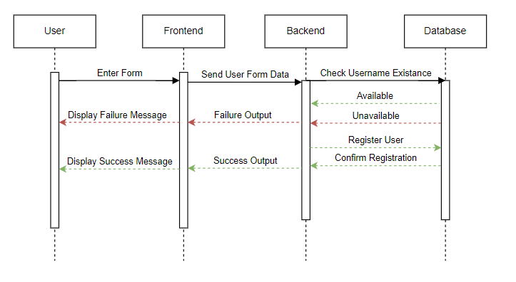
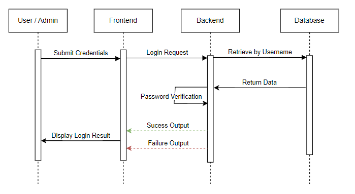
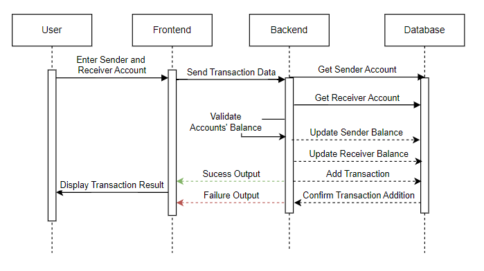

# Requirements and Design Documentation

### Product Planning for Star Bank

#### Product Vision

Create a seamless banking experience that empowers every user to easily manage their finances, ensuring efficiency, security, and user satisfaction.

#### Product Mission

To provide users with an innovative, reliable, and secure banking platform, combining robust features with a user-centric interface for streamlined financial management.

#### Minimum Viable Product (MVP)

**Admin Portal:**

- The default admin account setup is for secure initial access.
- CRUD functionalities for efficient user management.
- Role and permission management for enhanced security and control.
- Password management features for secure credentials handling.

**User Portal:**

- User registration and account provisioning for onboarding.
- Secure login and account access functionalities.
- Account dashboard with detailed transaction and balance views.
- Money transfer with transaction limits and validations for user safety.

**Authentication and Security:**

- Basic authentication system for secure user access.
- Secure password storage using encryption protocols.
- Session management to prevent unauthorized access.

**Frontend User Interface:**

- User-friendly admin portal UI for efficient navigation.
- Intuitive user registration and login screens.
- Cleanly designed user account dashboard with critical features.
- Simple money transfer interface to enable seamless transactions.

**Testing Framework:**

- Functional testing for core features.
- Security testing to ensure data protection.
- UI testing for a consistent user experience.
- Integration testing for system-wide feature coherence.
- Automated testing set up for continuous improvement.

#### Requirements

**Functional Requirements:**

- Admin portal with comprehensive management features.
- User-friendly interfaces for account access and transactions.
- Robust authentication and session management for security.
- Efficient money transfer system with validations.

**Non-Functional Requirements:**

- Scalable infrastructure to handle growing user base and transactions.
- High-security standards for data encryption and access controls.
- Responsive design for both desktop and mobile access.
- Robust testing framework for a reliable user experience.

#### Objectives and Key Results (OKRs)

**Objective 1: Deliver the MVP with essential features within the next quarter.**

- **Key Results:**
  1. Deploy admin portal with CRUD operations and role management.
  2. Launch the user portal with registration, login, and account dashboard.
  3. Implement a secure money transfer system with limits and validations.
  4. Finalize basic authentication system and secure password storage.
  5. Test and release the MVP with full functionality on a staging environment.

**Objective 2: Strengthen platform security to safeguard user data.**

- **Key Results:**
  1. Achieve 100% secure password encryption by week 3.
  2. Complete three rounds of security testing with no critical vulnerabilities.
  3. Implement session management to auto-logout inactive users.
  4. Conduct penetration testing to identify and address potential risks.
  5. Ensure compliance with industry security standards by week 8.

**Objective 3: Enhance user experience with an intuitive design.**

- **Key Results:**
  1. Conduct 3 user feedback sessions to refine UI/UX design.
  2. Achieve a 90% positive user satisfaction score for ease of navigation.
  3. Reduce average user onboarding time by 25%.
  4. Ensure mobile responsiveness for key features by week 6.
  5. Address and resolve at least 80% of UI/UX-related issues reported during testing.

**Objective 4: Build a robust testing framework to ensure platform reliability.**

- **Key Results:**
  1. Develop and automate 50+ test cases for core features.
  2. Conduct integration testing to achieve 95% system coherence.
  3. Achieve a 98% success rate in functional testing.
  4. Resolve all critical and high-priority defects within 48 hours of detection.
  5. Maintain a testing schedule with 100% adherence to planned timelines.

**Objective 5: Streamline team collaboration for efficient development.**

- **Key Results:**
  1. Conduct daily stand-ups with 95% team participation.
  2. Achieve a 90% sprint completion rate without rollovers.
  3. Document all processes in a centralized knowledge repository.
  4. Organize at least 2 cross-team workshops to improve workflows.
  5. Reduce team blockers by 30% through enhanced communication channels.

#### Scrum Methodology

**Scrum Ceremonies:**

- **Backlog Grooming:** Refined and prioritized epics and features to align with the MVP goal. Updated the backlog weekly to ensure readiness for sprints.
- **Sprint Planning:** Planned sprint goals around core functionalities like admin portal, user portal, and authentication. Use Azure DevOps Boards to track progress and manage dependencies.
- **Daily Stand-ups:** Short daily meetings to share progress and identify blockers. Used Slack for asynchronous updates where necessary.
- **Sprint Review:** Demonstrated completed features, including admin and user portals, and gathered feedback for refinement.
- **Sprint Retrospective:** Reflected on sprint outcomes and identified opportunities for improvement—tracked action points in a shared repository.

**Tools and Integrations**

- **Azure DevOps:** Centralized backlog and sprint track. Manage epics, features, and user stories.
- **Azure Webhooks:** For getting Azure alerts in Slack.
- **GitHub:** Version control for development and CI/CD integration.
- **Slack:** Real-time collaboration and notifications.
- **Zoom:** Virtual meetings for sprint ceremonies and reviews.

#### Sprint Workflow

**Pre-Sprint:**

- Define sprint scope and refine user stories with clear acceptance criteria.
- Set up GitHub and Azure DevOps integrations.

**During Sprint:**

- Conduct daily stand-ups to resolve blockers promptly.
- Test features as they are developed to maintain quality.

**Post-Sprint:**

- Review sprint goals during the sprint review and gather feedback.
- Plan the next sprint based on updated priorities.

---

## Architechture Design & Planning

### Infrastructure Architecture Design

*Figure 1: Infrastructure Architechture Design*

#### GitHub

Github is the platform we used to host our infrastructure repository. The repo contains Bicep templates for each resource (see below). Github actions was used to fulfill the resource deployments.

#### App Service for containers

The main purpose of the App Service Container is to host the containerized backend application. It retrieves the Azure Container Registry credentials from the Key Vault which enables access to pull the container image for the backend. This resource depends on the App Service Plan for the compute resources, the Key Vault for secret retrieval, and the Azure Container Registry for the container image hosting. The App Service for Containers inputs the `appServicePlan.id` to link to the App Service Plan. The App Service for Containers outputs the App Service Host Name and the Managed Identity Principle ID.

#### App Service Plan

The App Service Plan is used to allocate resrouces (such as CPU, memory, etc.) to the app services (static website and container for backend). The App Service Plan outputs the `appServicePlan.id`.

#### PostgreSQL database

The PostgreSQL database is used to store and manage the user account information. It is hosted by the PostgreSQL server.

#### PostgreSQL server

This server provides access to the database by securely accessing the App Service Back End by using the admin managed identity. The postgreSQLAdministrators resource configures an Azure Active Directory service principle as the admin of the database by passing in the Managed Identity Principle ID from the App Service for Containers. The Admin is able to manage the databases, users, and permissions. The Server bicep outputs the `postgreSQLServer.id`.

#### Static website

The static website resource hosts the front end. It inputs the `appServicePlan.id` to link to the App Service Plan for its necessary resources. One interesting configuration is the `httpsOnly` set to true to ensure communication between users and the static site is secure. The static website outputs the hostname (a URL) for access to the deployed app.

#### Azure Container Registry

The Azure Container Registry stores the container images that will be used by the App Service. The ACR generates a user and two passwords that are needed by other modules for access. The ACR credential values are dynamically fetched using the `listCredentials` function and are stored in the Key Vault as secrets.

#### Key Vault

The Key Vault stores and encrpts sensitive information like the ACR credentials. By using a Key Vault, we securely access them without ever exposing them in plain text.

#### Log Analytics Workspace

The Log Analytics Workspace collects, stores, and analyzes log and telemetry data from the resources for monitoring.

#### Application Insights

Application Insights provides insights into the application performance, user behavior, and diagnostics of both the front and back end, which enables proactive issue detection and resolution.

#### **Modularization Strategy**

To streamline the deployment and management of the infrastructure, we used the following modularization strategy:

- **Separation of Concerns:**Each module in the repository is designed to handle a specific aspect of the infrastructure. This ensures maintainability, reusability, and scalability.
- **Main Bicep File:**The `main.bicep` file acts as the orchestration layer. It references all modules and integrates them with environment-specific configurations through JSON parameter files.
- **Modules:**

  - **App Service Container Module (`app-service-container.bicep`):**Configures the backend App Service, enabling system-assigned identity and secure integration with Key Vault and Azure Container Registry.
  - **Backend App Service Website Module (`app-service-website.bicep`):**Configures the frontend App Service websites, enabling HTTPS-only traffic, custom domains, and integration with the App Service Plan.
  - **PostgreSQL Module (`postgre-sql-server.bicep`):**Deploys the PostgreSQL server with AAD authentication and connects the App Service using managed identity.
  - **Database Module (`postgre-sql-db.bicep`):**Creates the database within the PostgreSQL server, with configurations such as charset and collation.
  - **Key Vault Module (`keyVault.bicep`):**Sets up the Key Vault for storing sensitive credentials like ACR admin credentials and database passwords.
  - **App Service Plan Module (`app-service-plan.bicep`):**Provisions compute resources shared by backend and frontend services.
  - **Azure Container Registry Module (`acr.bicep`):**
    Deploys the ACR to host containerized application images.
- **Environment-Specific Configuration:**

  - Separate parameter files (`dev.parameters.json`, `uat.parameters.json`, and `prod.parameters.json`(coming soon)) define environment-specific configurations like resource group names, locations, and sensitive values.
  - This supports consistency across environments while allowing flexibility.
- **Automation and CI/CD:**

  - GitHub Actions workflows automate the deployment process for each environment, triggered by `push`, `pull_request`, or `workflow_dispatch` events.
  - The modularized design ensures seamless integration of changes and simplifies troubleshooting.

### Environment Design

- **Which environments do we need for our workloads?**
  - And what configuration will our Azure services have for each environment?
- with the infra dev and the full stack dev

#### **Development Environment (DEV)**

| Azure Infra Service                  | Configurations                                                                                                                  |
| ------------------------------------ | ------------------------------------------------------------------------------------------------------------------------------- |
| **GitHub**                     | Triggers deployments via `push` or `workflow_dispatch` (manually). Uses separate `RESOURCE_GROUP_DEV`.                    |
| **App Service for containers** | `makenna-be-dev`, connected to the ACR for pulling the backend container image securely.                                      |
| **App Service Plan**           | `makenna-asp-dev`, SKU: `B1`, used for compute resources for backend and frontend.                                          |
| **PostgreSQL database**        | `makenna-db-dev`, hosted on `makenna-dbsrv-dev` with admin identity and AAD authentication enabled.                         |
| **Static website**             | `makenna-fe-dev`, hosted in the same `App Service Plan` as the backend.                                                     |
| **Azure Container Registry**   | `makennaacrdev`, stores backend container images. Admin credentials securely stored in Key Vault.                             |
| **Key Vault**                  | `makenna-keyvault-dev`, stores sensitive credentials like ACR admin credentials and PostgreSQL users.                         |
| **Log Analytics Workspace**    | Used for monitoring and collecting log data for resources in the development environment.**(check w/SRE)**                |
| **Application Insights**       | Configured for backend and frontend App Services to monitor application performance and diagnose issues.**(check w/SRE)** |

#### **User Acceptance Testing Environment (UAT)**

| Azure Infra Service                  | Configurations                                                                                                                  |
| ------------------------------------ | ------------------------------------------------------------------------------------------------------------------------------- |
| **GitHub**                     | Triggers deployments via `pull_request` or `workflow_dispatch`. Uses separate `RESOURCE_GROUP_UAT`.                       |
| **App Service for containers** | `makenna-be-uat`, connected to the ACR for pulling the backend container image securely.                                      |
| **App Service Plan**           | `makenna-asp-uat`, SKU: `B1`, used for compute resources for backend and frontend.                                          |
| **PostgreSQL database**        | `makenna-db-uat`, hosted on `makenna-dbsrv-uat` with admin identity and AAD authentication enabled.                         |
| **Static website**             | `makenna-fe-uat`, hosted in the same `App Service Plan` as the backend.                                                     |
| **Azure Container Registry**   | `makennaacruat`, stores backend container images. Admin credentials securely stored in Key Vault.                             |
| **Key Vault**                  | `makenna-keyvault-uat`, stores sensitive credentials like ACR admin credentials and PostgreSQL users.                         |
| **Log Analytics Workspace**    | Used for monitoring and collecting log data for resources in the user acceptance testing environment.**(check w/SRE)**    |
| **Application Insights**       | Configured for backend and frontend App Services to monitor application performance and diagnose issues.**(check w/SRE)** |

### **Production Environment (PROD)**

| **Azure Infra Service**              | **Configurations**                                                                                  |
|------------------------------------- |-----------------------------------------------------------------------------------------------------|
| **GitHub**                           | Triggers deployments via `push` or `workflow_dispatch` (manually). Uses separate `RESOURCE_GROUP_PROD`. |
| **App Service for containers**       | `makenna-be-prod`, connected to the ACR for pulling the backend container image securely.              |
| **App Service Plan**                 | `makenna-asp-prod`, SKU: **B1**, used for compute resources for backend and frontend.                 |
| **PostgreSQL database**              | `makenna-db-prod`, hosted on `makenna-dbsrv-prod` with admin identity and AAD authentication enabled. |
| **Static website**                   | `makenna-fe-prod`, hosted in the same `App Service Plan` as the backend.                              |
| **Azure Container Registry**         | `makennaacrprod`, stores backend container images. Admin credentials securely stored in Key Vault.     |
| **Key Vault**                        | `makenna-keyvault-prod`, stores sensitive credentials like ACR admin credentials and PostgreSQL users.|
| **Log Analytics Workspace**          | Used for monitoring and collecting log data for resources in the production environment.               |
| **Application Insights**             | Configured for backend and frontend App Services to monitor application performance and diagnose issues. |

### Well-Architected Framework

#### Reliability

**SLA**

| ASPECT                          | COMMITMENT                                                 | DETAILS                                                                                                                |
| ------------------------------- | ---------------------------------------------------------- | ---------------------------------------------------------------------------------------------------------------------- |
| **Uptime**                | 99.9%                                                      | Guarantees that the application will be operational 99.9% of the time for critical functionalities.                    |
| **Incident Response**     | Core functionalities                                       | Includes account access, financial transactions, and user authentication.                                              |
| **Transparency**          | Investigation and remediation within the next review cycle | Incidents impacting SLA commitments are logged, analyzed, and resolved promptly to restore normal service.             |
| **Measurement Tools**     | Failure communication                                      | Any SLA breach is transparently documented, with details shared with stakeholders, including timelines for resolution. |
| **Measurement Tools**     | Azure Monitor, Application Insights, Log Analytics         | Tools are used to track uptime, performance, and compliance with SLA objectives.                                       |
| **Monitoring Frequency**  | Continuous                                                 | Real-time monitoring ensures proactive identification and resolution of issues.                                        |
| **Stakeholder Reporting** | Regular updates on system performance                      | Stakeholders receive detailed reports outlining uptime, issues encountered, and resolution timelines.                  |

**SLOs and SLIs**

| **SLO**                         | **Target**                                       | **SLI**                                                                      |
| ------------------------------------- | ------------------------------------------------------ | ---------------------------------------------------------------------------------- |
| **Account Availability**        | 95% success rate for account access requests.          | Indicated by successful HTTP responses / total number of account access attempts. |
| **Time to Access**              | 85% of requests should complete within 500ms monthly.  | Indicated by page load time in ms.                                                 |
| **Transaction Processing Time** | 99% of transactions processed in under 2 seconds.      | Indicated by API response times.                                                   |
| **Login Success Rate**          | 99.9% login success rate without system-driven errors. | Indicated by the percentage of successful user login attempts.                     |
| **Fund Transfer Accuracy**      | 99.99% of transfers accurate.                          | Indicated by comparing transaction logs with user inputs.                          |

Our monitoring strategy consists on use the Log Analytics Workspace to aggregate logs and performance data from all application components, with contant monitoring of the SLIs.

Application Insights will monitor a set of key performance indicators, including:

- User interactions
- API repsonse times
- Dependency health

Azure Monitor sets up alerts to call a team if there has been an SLA or SLO breach. Slack and Teams have been integrated with it via Azure Logic Apps for this.

Diagnostic settings are enabled on all critical resources, including Key Vault, App Insights, and App Service for deep logging and monitoring. The same data is analyzed for further insight using custom KQL queries in Log Analytics that provide actionable insights about system performance and reliability.

Continuous performance reviews, underpinned by the dashboards and alerts, ensure issues that are about to occur are dealt with well in advance of the time when users get affected. Incident response playbooks are triggered during an alert to walk the team through the resolution to restore compliance with the SLAs and SLOs.

#### Security

https://learn.microsoft.com/en-us/devops/devsecops/enable-devsecops-azure-github#secure-your-code-with-github
https://learn.microsoft.com/en-us/devops/devsecops/enable-devsecops-azure-github#secure-your-code-with-github
https://best.openssf.org/Concise-Guide-for-Developing-More-Secure-Software

#### Cost Optimization

- Burstable SKU for PostgreSQL Server: This setting configures the PostgreSQL server with the Standard_B1ms SKU, a burstable VM type (meaning that the server can “burst” to higher levels to support occasional spikes in usage). This setup optimizes costs by allocating resources dynamically.
- Basic SKU for Azure Container Registry: The ACR's SKU is set to Basic in the dev and UAT environments, which reduces costs for non-critical workloads while still supporting required container operations.
- Environment-Specific Parameters: Beneficial because it allows environment specific parameters to ensure that non-production environments use less expensive resources, (ex: flask_debug is set to 0 in non production environments) while still offering flexibility in the prod environment.

#### Operational Excellence

- with full stack dev
- Collaborate to create Azure Dashboards for SLO compliance tracking and holistic observability.

#### Performance Efficiency

- Parameterized Deployments with Bicep: Adapts deployments to specific environment needs, without requiring manual changes.
- Application insights monitoring: Integrated for all environments to monitor application performance metrics and identify bottlenecks, allowing for proactive optimization.
- Conduct load testing for SLI 2: Page Load Time and SLI 3: Transaction Processing Time.
- Optimize scalability of infrastructure to handle peak loads while maintaining performance thresholds.

---

## Software Design & Planning

### Release Strategy Design

The release strategy follows a DTAP (Development, Testing, Acceptance, and Production) environment approach. Each environment is managed separately, leveraging Azure services to ensure proper isolation and scalability. GitHub Actions have been configured to handle CI/CD for development, UAT, and production workflows. The strategy ensures:

Development branch triggers deployment to the DEV environment.
Pull requests to the main branch deploy to UAT.
Successful merges into the main branch trigger production deployments.
The strategy also incorporates Test-Driven Development (TDD) principles to validate functionality before integration, ensuring quality and robustness at every stage.

### CI/CD Pipeline and Release Strategy

#### Git feature branch strategy

- The startegy adopted for both Backend and Frontend focused on the implementation of short-lived feauture branches derived from the main branch. This helped managing updates to the code and better understanding and debugging of code due to its modular nature, as each feature, user story or task was done on seperate branches. After checking that the workflow actions fully deploy and work, a pull request is made, where two reviewers are called to give their approval for the merging to the main branch.
- Examples:

  - backend had branches called containerization, one called backendci (here the implementation of backed CI/CD was implemented), ayacibe (where another approach to CI/CD was implemnted) and prodcicd (where the variables and parameters to integrate and deploy the backend in the Production resource group)
  - frontend had two branches for the CI/CD with two different approaches (ayacife and ciayafe), and three branches where errors were fixed called ayanew, fixingfe and null-cookie-fix. And one last one called prod where the yml file was changed to integrate and deploy in the production environment.

#### Frontend

**CI Description**

The CI pipeline is in charge of development and integration as well as verification of the rest API implementation for the respective Vue.js based frontend applications.

1. Dependency Installation:
   the jobs start with installing all required dependencies in a clean, consistent environment using `npm ci`. Then it ensure that all packages and dependicies are conssitent with what was outlined in the package-lock.json where version of the dependencies were defined.
2. Build Verification:
   This job is split into three parts for the three environments (DEV, UAT, PROD) and ensures that it compiles correctly
3. Linting:
   Executes npm run lint to perform static code analysis and enforce coding standards, reducing errors and maintaining code consistency.
4. Artifact Upload:
   This part Uploads the compiled build artifacts (e.g., dist-dev or dist-uat) as deployable outputs for the CD pipeline.

**CD Description**

The CD pipeline deploys built artifacts to the respective Azure environments:

Artifact Download: Downloads the prepared build artifacts.
Azure Login: Authenticates with Azure using a service principal.
Deployment: Deploys the frontend to the static web app service for DEV or UAT, depending on the trigger.

After the CI were building jobs are executed to build in the correct environment, an artifact is then uploaded and deployed in the respective Azure environments, this execution follows the following steps:

1. Artifact Download:
   Downloads the prepared build artifacts.
2. Azure Login:
   Authenticates to Azure using GitHub-provided credentials linked to a service principal.
3. Deployment:
   Deploys the artifacts to Azure Static Web Apps using azure/static-web-apps-deploy action, targeting the appropriate environment (DEV or UAT or PROD) based on the branch.

#### Backend

**CI Description**
The backend CI pipeline validates the Flask-based API, as defined in ie-bank-backend.yml. Key steps include:

1. Environment Setup:
   Using pip install all python dependencies which are defined in the requirements.txt are to be installed. then the 3 environemnt and their appropriate variables (`BACKEND_WEBAPP`, `DOCKER_REGISTRY_SERVER_URL`, `IMAGE_NAME`, `KEY_VAULT_NAME`) are defined for all environemnts.
2. Static Analysis:
   flake8 is implemnetd to enforce Python coding standards and catching potential bugs or syntax issues early.
3. Unit Testing:
   Unit and Functional Testing: Executes pytest for unit and functional tests to validate core API functionality, using a PostgreSQL test database defined in the workflow.

Coverage Reports: After testing the coverage reports are then geneated and uploaded using pytest-cov, ensuring all critical code paths are tested.

As specified in `ie-bank-backend.yml`, the Flask based API is automated tested at this point. The key steps include:

1. Environment Setup:
   Using pip install all python dependencies which are defined in the requirements.txt are to be installed. then the 3 environemnt and their appropriate variables (`BACKEND_WEBAPP`, `DOCKER_REGISTRY_SERVER_URL`, `IMAGE_NAME`, `KEY_VAULT_NAME`) are defined for all environemnts.
2. Static Analysis:
   flake8 is implemnetd to enforce Python coding standards and catching potential bugs or syntax issues early.
3. Unit and Functional Testing:
   Executes pytest for unit and functional tests to validate core API functionality, using a PostgreSQL test database defined in the workflow.
4. Coverage Reports:
   after testing the coverage reports are then geneated and uploaded using pytest-cov, ensuring all critical code paths are tested.

**CD Description**

The CD pipeline builds and deploys the Flask backend as a Docker container:

Docker Build: Creates container images for DEV or UAT using environment-specific Dockerfiles.
Push to Registry: Publishes images to Azure Container Registry.
App Service Deployment: Deploys containers to Azure App Service.

The CD pipeline focuses on the containerization of the backend as a docker container and pushing it to the container registry in azure. it follows the outlines steps below:

1. Docker Build:
   Uses environment-specific Dockerfiles to create container images tailored to DEV, UAT or PROD environment.
2. Push to Container Registry in Azure:
   Publishes the Docker images to Azure Container Registry for centralized storage and secure access.
3. App Service Deployment:
   Deploys the backend containers to Azure App Services using the Azure CLI (az webapp create and az webapp config) or GitHub actions for streamlined deployment.

#### Test/behavior driven development strategy

The implemented Test/Behavior Driven Development (TDD) strategy helps to address the challenge of creating dependable software by starting from the ending-user by identifying user stories and acceptance criteria to inform creation of the tests. The strategy, as documented in the design document, seeks to develop automated unit and functional tests which check the critical functionalities of the backend, to ensure the implementation of relevant business logic.

The designed tests cover relevant areas of the backend which include:

1. Functional Tests: Validate essential features which the end user uses, like account balance operations (test_get_accounts) and new account registration (test_create_account). Also, non working links are tested, for example, test_dummy_wrong_path, to check how the API responds when it is fed text other than what it was intended for.
2. Unit Tests: Evaluate key parts of the backend, such as basic operations of the database model through the test_create_account test_case located in the test_model.py file to assist in future changes in the backend in respect to data.

The tests were run on pytest and a comprehensive test coverage report was produced. From the segregation of codes, it is observed that the quality of the functionality has been stressed while certain parts like the routes.py file can be improved because at the moment it has been only partially tested. This conforms to the iterative nature of TDD where tests are written first for the most critical code paths.

The User Stories that are fulfilled with these decisions are, for instance:

- "As a user, I want to create an account so that I can use the banking services"
- "As a user, I want to view my account details to track my finances."

As a result of following these stories when designing and running the tests, the members of the development team managed to satisfy user needs and at the same time ensure quality of the functionalities implemented.

#### Inner Loop and Outer Loop Definition

- Inner Loop: Focuses on the local development cycle, when developers are concerned with building, testing and debugging their code in their environment. You can consider writing and passing unit tests via Pytest for the backend and unit linting or static analysis tools to maintain code quality. The objective of the inner loop is to allow the developers to catch the issues at hand early enough before they make a submission to the shared repository.
- Outer Loop: The focus shifts to the integration and deployment of the processes at the team level. It all starts when a developer commits changes to a feature branch in GitHub. Automated Continuous Integration (CI) pipelines get triggered which execute the tests, static analysis and building processes on several environments. Once the changes are merged into the main branch, upon passing CI, it initiates the Continuous Deployment (CD). This ensures that all the changes are first validated either in staging or in UAT environments before pushing to production.

This approach, combining inner and outer loop strategies, provide an end to end pipeline from development to deployment while minimizing risks and instabilities of the application at all stages.

### Use Cases and Sequential Model Design

#### Registration

#### Login

#### Transaction

### Entity Relationship Diagram

*Figure #. Entity Relationship Diagram*

### Data Flow Diagram

*Figure #. Data Flow Diagram*

### 12 Factor App Design

1. **Codebase**
   One codebase tracked in revision control, many deploys
2. **Dependencies**
   Explicitly declare and isolate dependencies
3. **Config**
   Store config in the environment
4. **Backing services**
   Treat backing services as attached resources
5. **Build, release, run**
   Strictly separate build and run stages
6. **Processes**
   Execute the app as one or more stateless processes
7. **Port binding**
   Export services via port binding
8. **Concurrency**
   Scale out via the process model
9. **Disposability**
   Maximize robustness with fast startup and graceful shutdown
10. **Dev/prod parity**
    Keep development, staging, and production as similar as possible
11. **Logs**
    Treat logs as event streams
12. **Admin processes**
    Run admin/management tasks as one-off processes

### Infrastructure Release Strategy

Our infrastructure release strategy ensures a streamlined and automated approach to managing infrastructure deployments across environments thanks to the CI/CD approach and GitHub actions. The CI workflow is delineated in the `ie-bank-infra.yml` file. It ensures that the infrastructure code is validated and linted whenever changes are pushed to the repository or a pull request is created. This ensures that any syntax or structural errors in the Bicep templates are caught early in the development lifecycle. The CD workflow is delineated in the `ie-bank-infra.yml file`. It automates the deployment of infrastructure to different environments. We have an environment specific strategy, where the dev environment experiences frequent deployments to test and validate changes in the initial stages of development, the UAT environment is only deployed when a branch is merged to main, and the production environment is only deployed when all checks and validations are passed.

This automatched deployment approach is beneficial because it minimizes manual errors, ensures consistency across environments.

### Documented User Stories

#### Default Admin Account Setup

- **Description:** As a bank administrator, I want to use a default admin account to log into the system so that I can access the user management portal immediately after setup.
- **Acceptance Criteria:**
  - Default admin credentials allow successful login after setup.
  - Admin dashboard is accessible upon login.
  - System prevents unauthorized access to the admin account.

#### User CRUD Operations

- **Description:** As a bank administrator, I want to view a list of all bank users so that I can monitor user activity and information.
- **Acceptance Criteria:**
  - Admin can view a list of all users.
  - Admin can create, edit, or delete user accounts.
  - System validates and saves changes to user data.

#### Password Management

- **Description:** As an admin, I want to be able to create accounts for users to help them get started.
- **Acceptance Criteria:**
  - Admin can create accounts with temporary passwords.
  - Users are prompted to reset passwords on first login.
  - Password reset link is functional and secure.

#### User Roles and Permissions

- **Description:** As a bank administrator, I want to make sure users cannot access bank admin dashboards and abilities.
- **Acceptance Criteria:**
  - Admin-only dashboards are inaccessible to users.
  - User roles define access to specific system features.
  - Unauthorized access attempts are logged.

#### User Registration

- **Description:** As a user, I want to be able to create and use a secure personal account so that I can manage my transactions and bank details.
- **Acceptance Criteria:**
  - New users can register with valid credentials.
  - Users receive a confirmation email upon successful registration.
  - Duplicate registrations are prevented.

#### Account Provisioning

- **Description:** As a registered user, I want to view my account number and balance so that I can manage my finances.
- **Acceptance Criteria:**
  - Users can view their assigned account number.
  - Account balance is displayed correctly.
  - System updates balances in real-time.

#### Login and Account Access

- **Description:** As a user, I want to log in with my credentials so that I can access my bank account securely.
- **Acceptance Criteria:**
  - Users can log in using valid credentials.
  - Failed login attempts are logged and limited.
  - System redirects users to their dashboard after login.

#### Account Dashboard

- **Description:** As a user, I want to view all my transactions in my account dashboard so that I can track my spending.
- **Acceptance Criteria:**
  - Dashboard displays account balance and recent transactions.
  - Users can filter transactions by date or type.
  - System updates dashboard data in real-time.

#### Money Transfer

- **Description:** As a user, I want to transfer money to another account within the bank by entering the recipient’s account number and amount.
- **Acceptance Criteria:**
  - Users can transfer money by entering a valid recipient account number.
  - Transfer fails if the recipient’s account doesn’t exist.
  - Users receive a success message for completed transactions.

#### Transaction Limits and Validation

- **Description:** As a user, I want to receive an error message if I attempt to transfer more than my available balance.
- **Acceptance Criteria:**
  - Transfers exceeding the available balance are blocked.
  - Users see a clear error message when a transfer fails.
  - System updates account balance only after successful transfers.

#### Basic Authentication System

- **Description:** As a user, I want to be able to log in with my own username and password to gain access to my secured bank account from anywhere while using the web app.
- **Acceptance Criteria:**
  - Users can log in using a valid username and password.
  - Invalid credentials return an error message.
  - System supports login from multiple devices.

#### Secure Password Storage

- **Description:** As a user, I want to be sure that my password and other login credentials are stored in a secure place that bad actors cannot access to gain unauthorized access to my account.
- **Acceptance Criteria:**
  - Passwords are encrypted before being stored.
  - Admins cannot view stored passwords.
  - System meets industry security standards (e.g., hashing).

#### Session Management

- **Description:** As a user, I want to make sure that my session is automatically closed after a period of time so that nobody else can access it in my absence from a device I've used.
- **Acceptance Criteria:**
  - User sessions expire after 15 minutes of inactivity.
  - Users are logged out automatically upon session expiration.
  - Logged-out users are redirected to the login page.

#### Admin Portal UI

- **Description:** As a bank administrator, I want an interface to view, add, edit, and delete users so that I can manage the user accounts effectively.
- **Acceptance Criteria:**
  - Admins can view, add, edit, and delete users using the interface.
  - Changes made by admins are saved and reflected immediately.
  - Interface provides confirmation messages for all actions.

#### User Registration UI

- **Description:** As a new user, I want a simple registration form so that I can sign up without difficulty and create an account and start using the banking system.
- **Acceptance Criteria:**
  - Registration form captures all necessary details.
  - Form validation prevents submission of incomplete data.
  - Users receive feedback on successful registration.

#### User Login

- **Description:** As a user, I want a simple login form to access my account quickly so that I can securely access my bank accounts and transactions.
- **Acceptance Criteria:**
  - Login form accepts valid credentials.
  - Users see error messages for invalid credentials.
  - Successful login redirects users to the dashboard.

#### User Account Dashboard

- **Description:** As a bank user, I want to view my account balance and account number on the dashboard so that I can easily keep track of my finances.
- **Acceptance Criteria:**
  - Dashboard displays account balance and number accurately.
  - Users can view recent transactions on the dashboard.
  - Data is updated in real-time with no delays.

#### Functional Testing

- **Description:** As a tester, I want to make sure every feature works as expected under unexpected edge cases.
- **Acceptance Criteria:**
  - Each feature works as expected under normal and edge cases.
  - Test cases cover all critical user actions.
  - Failures are documented with detailed logs.

#### Security Testing

- **Description:** As a tester, I want to verify the security practices function as intended.
- **Acceptance Criteria:**
  - System blocks unauthorized access attempts.
  - Sensitive user data is encrypted during transit and at rest.
  - Penetration tests identify no critical vulnerabilities.

#### UI Testing

- **Description:** As a tester, I want to ensure the UI buttons function as intended.
- **Acceptance Criteria:**
  - All buttons, forms, and links are functional.
  - Navigation across the interface is smooth and consistent.
  - UI elements match design specifications.

#### Integration Testing

- **Description:** As a tester, I want to check that backend and infrastructure communicate as intended with the application’s front end.
- **Acceptance Criteria:**
  - Backend and frontend communicate seamlessly.
  - API calls return expected results within 2 seconds.
  - Data flows correctly between all system components.

#### Automated Testing Setup

- **Description:** As a tester, I want to make sure the system informs within 10 seconds of a fatal system error.
- **Acceptance Criteria:**
  - System alerts testers of critical errors within 10 seconds.
  - Automated scripts cover all critical system workflows.
  - Reports are generated automatically after test completion.
