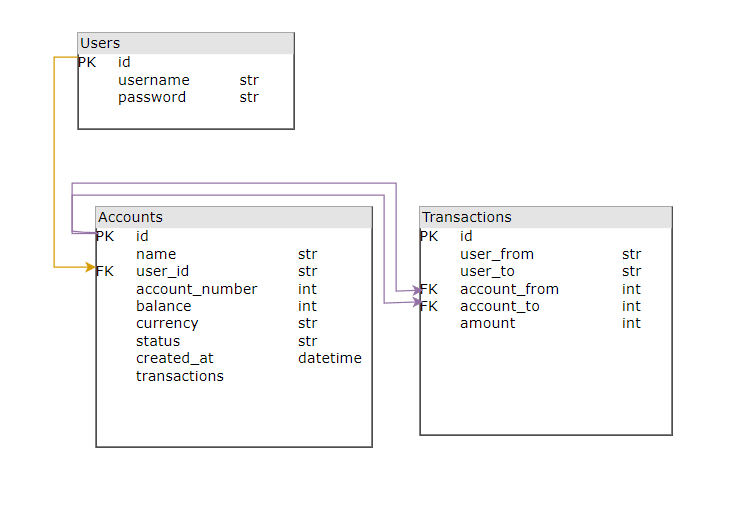

# Requirements and Design Documentation

### Overview & Introduction

Explain what our project does in 5 sentences or less. Describe the core functionalities (namely functional req and non func req).

---

## Architechture Design & Planning

### Infrastructure Architecture Design

*Figure 1: Infrastructure Architechture Design*

#### GitHub

Github is the platform we used to host our infrastructure repository. The repo contains Bicep templates for each resource (see below). Github actions was used to fulfill the resource deployments.

#### App Service for containers

The main purpose of the App Service Container is to host the containerized backend application. It retrieves the Azure Container Registry credentials from the Key Vault which enables access to pull the container image for the backend. This resource depends on the App Service Plan for the compute resources, the Key Vault for secret retrieval, and the Azure Container Registry for the container image hosting. The App Service for Containers inputs the `appServicePlan.id` to link to the App Service Plan. The App Service for Containers outputs the App Service Host Name and the Managed Identity Principle ID.

#### App Service Plan

The App Service Plan is used to allocate resrouces (such as CPU, memory, etc.) to the app services (static website and container for backend). The App Service Plan outputs the `appServicePlan.id`.

#### PostgreSQL database

The PostgreSQL database is used to store and manage the user account information. It is hosted by the PostgreSQL server.

#### PostgreSQL server

This server provides access to the database by securely accessing the App Service Back End by using the admin managed identity. The postgreSQLAdministrators resource configures an Azure Active Directory service principle as the admin of the database by passing in the Managed Identity Principle ID from the App Service for Containers. The Admin is able to manage the databases, users, and permissions. The Server bicep outputs the `postgreSQLServer.id`.

#### Static website

The static website resource hosts the front end. It inputs the `appServicePlan.id` to link to the App Service Plan for its necessary resources. One interesting configuration is the `httpsOnly` set to true to ensure communication between users and the static site is secure. The static website outputs the hostname (a URL) for access to the deployed app.

#### Azure Container Registry

The Azure Container Registry stores the container images that will be used by the App Service. The ACR generates a user and two passwords that are needed by other modules for access. The ACR credential values are dynamically fetched using the `listCredentials` function and are stored in the Key Vault as secrets.

#### Key Vault

The Key Vault stores and encrpts sensitive information like the ACR credentials. By using a Key Vault, we securely access them without ever exposing them in plain text.

#### Log Analytics Workspace

The Log Analytics Workspace collects, stores, and analyzes log and telemetry data from the resources for monitoring.

#### Application Insights

Application Insights provides insights into the application performance, user behavior, and diagnostics of both the front and back end, which enables proactive issue detection and resolution.

#### **Modularization Strategy**

To streamline the deployment and management of the infrastructure, we used the following modularization strategy:

- **Separation of Concerns:**Each module in the repository is designed to handle a specific aspect of the infrastructure. This ensures maintainability, reusability, and scalability.
- **Main Bicep File:**The `main.bicep` file acts as the orchestration layer. It references all modules and integrates them with environment-specific configurations through JSON parameter files.
- **Modules:**

  - **App Service Container Module (`app-service-container.bicep`):**Configures the backend App Service, enabling system-assigned identity and secure integration with Key Vault and Azure Container Registry.
  - **Backend App Service Website Module (`app-service-website.bicep`):**Configures the frontend App Service websites, enabling HTTPS-only traffic, custom domains, and integration with the App Service Plan.
  - **PostgreSQL Module (`postgre-sql-server.bicep`):**Deploys the PostgreSQL server with AAD authentication and connects the App Service using managed identity.
  - **Database Module (`postgre-sql-db.bicep`):**Creates the database within the PostgreSQL server, with configurations such as charset and collation.
  - **Key Vault Module (`keyVault.bicep`):**Sets up the Key Vault for storing sensitive credentials like ACR admin credentials and database passwords.
  - **App Service Plan Module (`app-service-plan.bicep`):**Provisions compute resources shared by backend and frontend services.
  - **Azure Container Registry Module (`acr.bicep`):**
    Deploys the ACR to host containerized application images.
- **Environment-Specific Configuration:**

  - Separate parameter files (`dev.parameters.json`, `uat.parameters.json`, and `prod.parameters.json`(coming soon)) define environment-specific configurations like resource group names, locations, and sensitive values.
  - This supports consistency across environments while allowing flexibility.
- **Automation and CI/CD:**

  - GitHub Actions workflows automate the deployment process for each environment, triggered by `push`, `pull_request`, or `workflow_dispatch` events.
  - The modularized design ensures seamless integration of changes and simplifies troubleshooting.

### Environment Design

- **Which environments do we need for our workloads?**
  - And what configuration will our Azure services have for each environment?
- with the infra dev and the full stack dev

#### **Development Environment (DEV)**

| Azure Infra Service                  | Configurations                                                                                                                  |
| ------------------------------------ | ------------------------------------------------------------------------------------------------------------------------------- |
| **GitHub**                     | Triggers deployments via `push` or `workflow_dispatch` (manually). Uses separate `RESOURCE_GROUP_DEV`.                    |
| **App Service for containers** | `makenna-be-dev`, connected to the ACR for pulling the backend container image securely.                                      |
| **App Service Plan**           | `makenna-asp-dev`, SKU: `B1`, used for compute resources for backend and frontend.                                          |
| **PostgreSQL database**        | `makenna-db-dev`, hosted on `makenna-dbsrv-dev` with admin identity and AAD authentication enabled.                         |
| **Static website**             | `makenna-fe-dev`, hosted in the same `App Service Plan` as the backend.                                                     |
| **Azure Container Registry**   | `makennaacrdev`, stores backend container images. Admin credentials securely stored in Key Vault.                             |
| **Key Vault**                  | `makenna-keyvault-dev`, stores sensitive credentials like ACR admin credentials and PostgreSQL users.                         |
| **Log Analytics Workspace**    | Used for monitoring and collecting log data for resources in the development environment.**(check w/SRE)**                |
| **Application Insights**       | Configured for backend and frontend App Services to monitor application performance and diagnose issues.**(check w/SRE)** |

---

#### **User Acceptance Testing Environment (UAT)**

| Azure Infra Service                  | Configurations                                                                                                                  |
| ------------------------------------ | ------------------------------------------------------------------------------------------------------------------------------- |
| **GitHub**                     | Triggers deployments via `pull_request` or `workflow_dispatch`. Uses separate `RESOURCE_GROUP_UAT`.                       |
| **App Service for containers** | `makenna-be-uat`, connected to the ACR for pulling the backend container image securely.                                      |
| **App Service Plan**           | `makenna-asp-uat`, SKU: `B1`, used for compute resources for backend and frontend.                                          |
| **PostgreSQL database**        | `makenna-db-uat`, hosted on `makenna-dbsrv-uat` with admin identity and AAD authentication enabled.                         |
| **Static website**             | `makenna-fe-uat`, hosted in the same `App Service Plan` as the backend.                                                     |
| **Azure Container Registry**   | `makennaacruat`, stores backend container images. Admin credentials securely stored in Key Vault.                             |
| **Key Vault**                  | `makenna-keyvault-uat`, stores sensitive credentials like ACR admin credentials and PostgreSQL users.                         |
| **Log Analytics Workspace**    | Used for monitoring and collecting log data for resources in the user acceptance testing environment.**(check w/SRE)**    |
| **Application Insights**       | Configured for backend and frontend App Services to monitor application performance and diagnose issues.**(check w/SRE)** |

#### Production Environment (PROD)

| Azure Infra Service                  | Configurations |
| ------------------------------------ | -------------- |
| **GitHub**                     |                |
| **App Service for containers** |                |
| **App Service Plan**           |                |
| **PostgreSQL database**        |                |
| **Static website**             |                |
| **Azure Container Registry**   |                |
| **Key Vault**                  |                |
| **Log Analytics Workspace**    |                |
| **Application Insights**       |                |

### Well-Architected Framework

#### Reliability

**SLA**

| ASPECT                          | COMMITMENT                                                 | DETAILS                                                                                                                |
| ------------------------------- | ---------------------------------------------------------- | ---------------------------------------------------------------------------------------------------------------------- |
| **Uptime**                | 99.9%                                                      | Guarantees that the application will be operational 99.9% of the time for critical functionalities.                    |
| **Incident Response**     | Core functionalities                                       | Includes account access, financial transactions, and user authentication.                                              |
| **Transparency**          | Investigation and remediation within the next review cycle | Incidents impacting SLA commitments are logged, analyzed, and resolved promptly to restore normal service.             |
| **Measurement Tools**     | Failure communication                                      | Any SLA breach is transparently documented, with details shared with stakeholders, including timelines for resolution. |
| **Measurement Tools**     | Azure Monitor, Application Insights, Log Analytics         | Tools are used to track uptime, performance, and compliance with SLA objectives.                                       |
| **Monitoring Frequency**  | Continuous                                                 | Real-time monitoring ensures proactive identification and resolution of issues.                                        |
| **Stakeholder Reporting** | Regular updates on system performance                      | Stakeholders receive detailed reports outlining uptime, issues encountered, and resolution timelines.                  |

**SLOs and SLIs**

| **SLO**                         | **Target**                                       | **SLI**                                                                      |
| ------------------------------------- | ------------------------------------------------------ | ---------------------------------------------------------------------------------- |
| **Account Availability**        | 95% success rate for account access requests.          | Indicated by successful HTTP responses / total number of account access attempts. |
| **Time to Access**              | 85% of requests should complete within 500ms monthly.  | Indicated by page load time in ms.                                                 |
| **Transaction Processing Time** | 99% of transactions processed in under 2 seconds.      | Indicated by API response times.                                                   |
| **Login Success Rate**          | 99.9% login success rate without system-driven errors. | Indicated by the percentage of successful user login attempts.                     |
| **Fund Transfer Accuracy**      | 99.99% of transfers accurate.                          | Indicated by comparing transaction logs with user inputs.                          |

Our monitoring strategy consists on use the Log Analytics Workspace to aggregate logs and performance data from all application components, with contant monitoring of the SLIs.

Application Insights will monitor a set of key performance indicators, including:

- User interactions
- API repsonse times
- Dependency health

Azure Monitor sets up alerts to call a team if there has been an SLA or SLO breach. Slack and Teams have been integrated with it via Azure Logic Apps for this.

Diagnostic settings are enabled on all critical resources, including Key Vault, App Insights, and App Service for deep logging and monitoring. The same data is analyzed for further insight using custom KQL queries in Log Analytics that provide actionable insights about system performance and reliability.

Continuous performance reviews, underpinned by the dashboards and alerts, ensure issues that are about to occur are dealt with well in advance of the time when users get affected. Incident response playbooks are triggered during an alert to walk the team through the resolution to restore compliance with the SLAs and SLOs.

#### Security

https://learn.microsoft.com/en-us/devops/devsecops/enable-devsecops-azure-github#secure-your-code-with-github
https://learn.microsoft.com/en-us/devops/devsecops/enable-devsecops-azure-github#secure-your-code-with-github
https://best.openssf.org/Concise-Guide-for-Developing-More-Secure-Software

#### Cost Optimization

- Burstable SKU for PostgreSQL Server: This setting configures the PostgreSQL server with the Standard_B1ms SKU, a burstable VM type (meaning that the server can “burst” to higher levels to support occasional spikes in usage). This setup optimizes costs by allocating resources dynamically.
- Basic SKU for Azure Container Registry: The ACR’s SKU is set to Basic in the dev and UAT environments, which reduces costs for non-critical workloads while still supporting required container operations.
- Environment-Specific Parameters: Beneficial because it allows environment specific parameters to ensure that non-production environments use less expensive resources, (ex: flask_debug is set to 0 in non production environments) while still offering flexibility in the prod environment.

#### Operational Excellence

- with full stack dev
- Collaborate to create Azure Dashboards for SLO compliance tracking and holistic observability.

#### Performance Efficiency

- Parameterized Deployments with Bicep: Adapts deployments to specific environment needs, without requiring manual changes.
- Application insights monitoring: Integrated for all environments to monitor application performance metrics and identify bottlenecks, allowing for proactive optimization.
- Conduct load testing for SLI 2: Page Load Time and SLI 3: Transaction Processing Time.
- Optimize scalability of infrastructure to handle peak loads while maintaining performance thresholds.

---

## Software Design & Planning

### Release Strategy Design

The release strategy follows a DTAP (Development, Testing, Acceptance, and Production) environment approach. Each environment is managed separately, leveraging Azure services to ensure proper isolation and scalability. GitHub Actions have been configured to handle CI/CD for development, UAT, and production workflows. The strategy ensures:

Development branch triggers deployment to the DEV environment.
Pull requests to the main branch deploy to UAT.
Successful merges into the main branch trigger production deployments.
The strategy also incorporates Test-Driven Development (TDD) principles to validate functionality before integration, ensuring quality and robustness at every stage.

### CI/CD Pipeline and Release Strategy

#### Frontend

**CI Description**
The CI pipeline automates testing and building Vue.js-based frontend applications.
Steps:

Dependency Installation: Ensures all project dependencies are resolved via npm install.
Build Verification: Builds the frontend using the build:dev or build:uat script depending on the branch/environment.
Linting/Static Analysis: Ensures the code adheres to style guidelines to avoid syntax and logic errors.
Artifact Upload: Prepared builds are uploaded for deployment.

- Errors addressed:

  - Missing dependencies (e.g., axios, vue-router) were resolved by updating package.json.
  - Adjusted vue.config.js for compatibility with development and UAT builds

**CD Description**
The CD pipeline deploys built artifacts to the respective Azure environments:

Artifact Download: Downloads the prepared build artifacts.
Azure Login: Authenticates with Azure using a service principal.
Deployment: Deploys the frontend to the static web app service for DEV or UAT, depending on the trigger.

- Fixed Issues:

Proper artifact paths (dist-dev or dist-uat) ensured successful deployments without file-not-found errors.

#### Backend

**CI Description**
The CI pipeline validates the Flask backend API:

Environment Setup: Python dependencies are installed, including test libraries.
Linting: Static analysis using tools like Flake8.
Unit Testing: Pytest is used for unit tests with PostgreSQL configuration through GitHub secrets.
Coverage Reports: Generates code coverage reports for validation.
Fixed Issues:

Addressed missing SQLALCHEMY_DATABASE_URI environment variables by properly setting secrets in workflows.

**CD Description**
The CD pipeline builds and deploys the Flask backend as a Docker container:

Docker Build: Creates container images for DEV or UAT using environment-specific Dockerfiles.
Push to Registry: Publishes images to Azure Container Registry.
App Service Deployment: Deploys containers to Azure App Service.

- Fixed Issues:

Fixed missing Dockerfiles and resolved registry authentication failures by retrieving credentials from Azure Key Vault.

### Use Cases and Sequential Model Design

#### Registration

#### Login

#### Transaction

### Entity Relationship Diagram

*Figure #. Entity Relationship Diagram*

### Data Flow Diagram

*Figure #. Data Flow Diagram*

### 12 Factor App Design

1. **Codebase**
   One codebase tracked in revision control, many deploys
2. **Dependencies**
   Explicitly declare and isolate dependencies
3. **Config**
   Store config in the environment
4. **Backing services**
   Treat backing services as attached resources
5. **Build, release, run**
   Strictly separate build and run stages
6. **Processes**
   Execute the app as one or more stateless processes
7. **Port binding**
   Export services via port binding
8. **Concurrency**
   Scale out via the process model
9. **Disposability**
   Maximize robustness with fast startup and graceful shutdown
10. **Dev/prod parity**
    Keep development, staging, and production as similar as possible
11. **Logs**
    Treat logs as event streams
12. **Admin processes**
    Run admin/management tasks as one-off processes

### Infrastructure Release Strategy

Our infrastructure release strategy ensures a streamlined and automated approach to managing infrastructure deployments across environments thanks to the CI/CD approach and GitHub actions. The CI workflow is delineated in the ie-bank-infra.yml file. It ensures that the infrastructure code is validated and linted whenever changes are pushed to the repository or a pull request is created. This ensures that any syntax or structural errors in the Bicep templates are caught early in the development lifecycle. The CD workflow is delineated in the ie-bank-infra.yml file. It automates the deployment of infrastructure to different environments. We have an environment specific strategy, where the dev environment experiences frequent deployments to test and validate changes in the initial stages of development, the UAT environment is only deployed when a branch is merged to main, and the production environment is only deployed when all checks and validations are passed.

This automatched deployment approach is beneficial because it minimizes manual errors, ensures consistency across environments.

### Documented User Stories

with product owner
